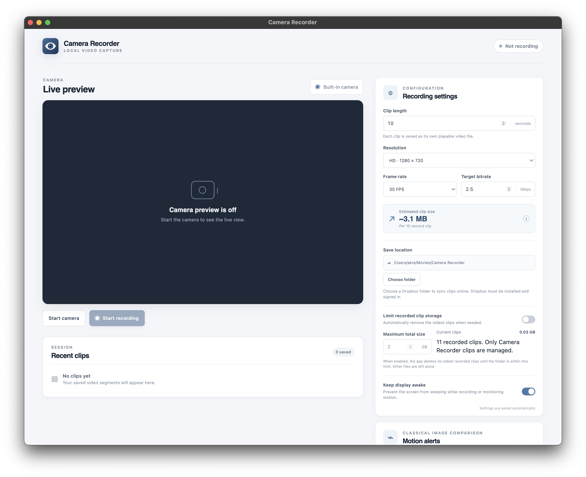

# Camera Recorder — Turn your laptop into a security camera

Use your MacBook or another Mac with a webcam as a security camera: preview the camera, record video locally, and receive Telegram snapshot alerts when motion is detected. Camera Recorder is a local-first Electron app with a macOS build and publicly available source code.

Record to a local folder without a cloud account, or choose a Dropbox-synced folder to sync your clips. Optional Telegram alerts let you check on a room from your phone, and the `/photo` command returns a current camera picture while the app and camera are running.



## How to use your laptop as a security camera

### Install and launch on macOS

You need a Mac with a working built-in or attached camera. To run from source, install Node.js and npm, then run:

```sh
git clone https://github.com/krand/db-sec-cam.git
cd db-sec-cam
npm install
npm run dev
```

To create a DMG installer instead, follow the [macOS package instructions](#macos-package).

### Set up recording

1. Position the laptop so the camera has a clear view of the area you want to monitor, and connect it to power for longer sessions.
2. Open Camera Recorder, choose **Start camera**, and allow camera access when macOS asks. If access was denied, enable it in **System Settings → Privacy & Security → Camera**.
3. In **Recording settings**, choose **Choose folder** to set the destination for your video clips. Set the clip duration, resolution, frame rate, and target bitrate.
4. Optionally enable **Limit recorded clip storage** and set a maximum total size. This deletes the oldest Camera Recorder clips when needed, including existing clips in the selected folder.
5. Choose **Start recording**. Video is saved as separate WebM clips; choose **Stop recording** to finish and save the current clip.
6. For notifications on your phone, [configure Telegram motion alerts](#configure-telegram-motion-alerts), enable motion monitoring, and walk through the scene to test detection.

Recording and motion monitoring are independent: motion alerts do not start or stop video recording. Keep the app open and the camera running while monitoring.

## Features

- Live preview from the built-in or attached camera.
- Video-only recording saved as independent WebM clips.
- Configurable clip duration, resolution, frame rate, and target bitrate.
- Approximate clip size shown from the selected target bitrate.
- Choose any local destination folder, including a Dropbox-synced folder.
- Optional total storage limit that removes the oldest Camera Recorder clips to stay under the configured size.
- Optional motion alerts using local, non-AI frame comparison, with a JPEG snapshot sent to Telegram when motion is detected.
- Optional Telegram bot notifications; no app server is required.
- Option to keep the display awake while recording or monitoring motion; otherwise the app prevents system idle sleep while allowing the display to sleep. On macOS, the display can also be turned off manually during recording and wakes on keyboard or mouse activity.
- Camera permission is requested through macOS and recordings stay local unless the destination folder is synced by another service.

## Configure Telegram motion alerts

Telegram notifications use a bot chat to send alerts to your personal Telegram account. The alert appears as a message from your bot; the app does not sign in as or send messages from your personal account. The bot API is free for normal single-user notifications, subject to Telegram's limits. No separate hosting or server is needed: this app sends messages directly to Telegram.

1. In Telegram, open [@BotFather](https://t.me/BotFather), send `/newbot`, and follow its prompts to create a dedicated bot.
2. Copy the bot token that BotFather gives you. Keep it private; anyone with the token can control that bot.
3. In Camera Recorder, open **Motion alerts**, paste the token, and choose **Save token**. The app verifies it and stores it using Electron's operating-system-backed secure storage.
4. Choose **Pair Telegram**. In the dialog, scan the QR code with your phone or open the pairing link in a browser or Telegram. Press **Start** in the bot chat, then return to Camera Recorder and choose **Check connection**. After pairing, the bot sends a welcome message with `/photo` instructions. The one-time link expires after five minutes; keep it private.
5. Choose **Send test** to confirm the bot can message you.
6. Turn on **Enable motion monitoring** and start the camera. Adjust the comparison interval, changed-area threshold, and alert cooldown to suit the scene.

Motion monitoring runs only while the app is open and its camera preview is active. It compares downscaled grayscale frames locally; it does not use AI or save comparison images. When the configured portion of the image changes, the app captures a JPEG snapshot (up to 1280 pixels on the longest side) and sends it with the alert. The snapshot is not saved on the Mac, but Telegram receives and retains it in the bot chat. An internet connection and Telegram availability are required for delivery. Use **Disconnect** to remove the saved bot token and connection.

While Camera Recorder is open and Telegram is connected, send `/photo` in the private bot chat to get a current picture. The camera preview must be running. The bot accepts commands only from the private chat connected in Camera Recorder; `/snapshot` is also supported.

## Development

The app uses Electron, React, and TypeScript. Follow the source setup above to run it with `npm run dev`. To build the app without creating an installer:

```sh
npm run build
```

## macOS package

```sh
npm run package:mac
```

The app requests camera permission only when the user starts the camera. It does not request microphone access or record audio.

This command creates a macOS DMG installer in `release/`.
